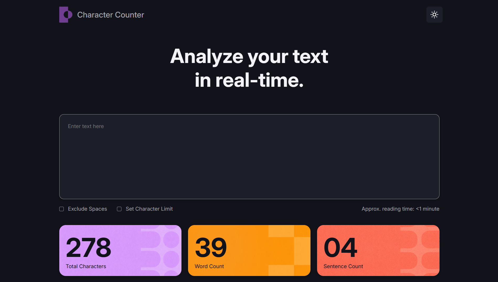
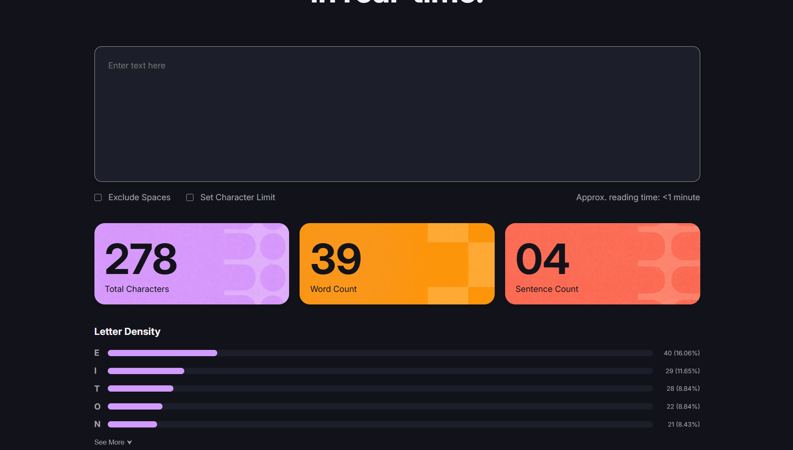

# Character Counter

## Objetivo del proyecto

El objetivo de este proyecto fue replicar una interfaz web utilizando únicamente HTML y CSS, sin agregar funcionalidades con JavaScript. La idea principal fue practicar maquetado web, uso de Flexbox, organización del código y estilización siguiendo una referencia visual proporcionada por el profesor.

---

## Tecnologías utilizadas

* HTML5
* CSS3
* Google Fonts (Inter)
* Git y GitHub para control de versiones

---

## Organización del HTML

El proyecto fue dividido en distintas secciones para mantener una estructura clara:

### Header

Contiene el logo, el nombre de la aplicación y el botón para el modo oscuro.

### Hero principal

Incluye el título principal y el textarea donde el usuario escribiría el texto a analizar.

### Controles

Debajo del textarea se agregaron dos checkboxes:

* Exclude Spaces
* Set Character Limit

También se incluyó un texto indicando el tiempo aproximado de lectura.

### Tarjetas de métricas

Se crearon tres tarjetas para mostrar:

* Total Characters
* Word Count
* Sentence Count

Los valores están hardcodeados porque la funcionalidad con JavaScript se implementará en etapas posteriores.

### Letter Density

Se agregó una sección para mostrar la frecuencia de distintas letras utilizando barras de progreso realizadas con divs estilizados mediante CSS.

---

## Cómo resolví el CSS

Para la maquetación utilicé principalmente Flexbox.

También trabajé con:

* Variables CSS utilizando :root para los colores.
* Border-radius para suavizar bordes.
* Hover en botones.
* Background images en las tarjetas de métricas.
* Espaciados utilizando gap, padding y margin.
* Diseño adaptable usando porcentajes y medidas flexibles.

Las barras de progreso de la sección Letter Density fueron realizadas con divs anidados, donde una barra representa el fondo y otra representa el porcentaje completado.

---

## Dificultades encontradas

Durante el desarrollo tuve algunas dificultades con:

* La alineación de elementos usando Flexbox.
* Mantener el mismo ancho visual entre distintas secciones.
* Organizar correctamente las filas de la sección Letter Density.
* Ajustar tamaños y espaciados para que el resultado se pareciera lo más posible al diseño de referencia.

Estas dificultades se resolvieron realizando pruebas, reorganizando contenedores y ajustando propiedades de Flexbox y tamaños relativos.

---

## Capturas del resultado final

### Vista general

### Sección Letter Density

link para ver la pagina: https://rigbin56-creator.github.io/character-counter/
---

## Repositorio

Este proyecto fue desarrollado como parte de la primera etapa del trabajo práctico de Character Counter. En futuras versiones se agregará JavaScript para realizar los cálculos de forma dinámica.
